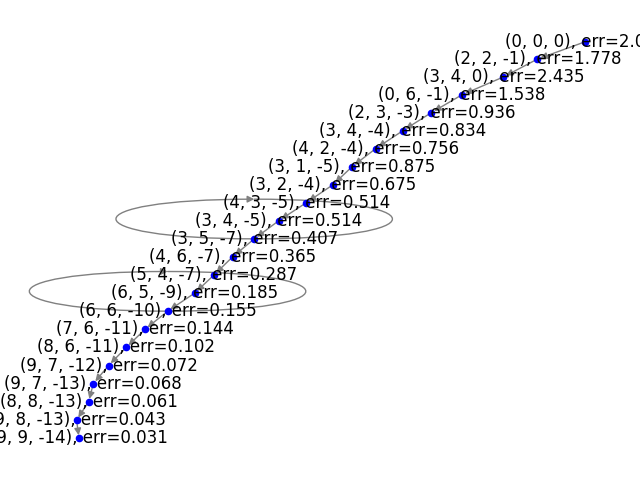

## Example Debug Console Output

For .

```
$ simulated_annealing -w DEBUG anneal
2024-02-28 21:07:45,470;WARNING;simulated_annealing;('nodes are in a cycle', [(-23, -30, -67), err=1.000, (-21, -32, -65), err=1.000, (-23, -30, -67), err=1.000])
2024-02-28 21:07:45,470;DEBUG;simulated_annealing;Static Order: cycle
2024-02-28 21:07:45,470;INFO;simulated_annealing;Winner: (-27, -30, -66), err=1.000
2024-02-28 21:07:45,471;INFO;simulated_annealing;Path Length: 113
2024-02-28 21:07:45,471;WARNING;simulated_annealing;Winner not good enough, restarting with attempt #3.
2024-02-28 21:07:45,471;DEBUG;simulated_annealing;initializing Neuron
2024-02-28 21:07:45,471;DEBUG;simulated_annealing;initializing ProblemGraph
2024-02-28 21:07:45,471;DEBUG;simulated_annealing;executing anneal command
2024-02-28 21:07:45,471;DEBUG;simulated_annealing;Initial: (0, 0, 0), err=2.000
2024-02-28 21:07:45,471;DEBUG;simulated_annealing;initializing Neuron
2024-02-28 21:07:45,471;DEBUG;simulated_annealing;-0.7243657277057198
2024-02-28 21:07:45,471;DEBUG;simulated_annealing;0.8333333333333334
2024-02-28 21:07:45,472;DEBUG;simulated_annealing;initializing Neuron
2024-02-28 21:07:45,472;DEBUG;simulated_annealing;0.4696492855901244
2024-02-28 21:07:45,472;DEBUG;simulated_annealing;Taking successor as better option (exploitation)
2024-02-28 21:07:45,472;DEBUG;simulated_annealing;initializing Neuron
2024-02-28 21:07:45,472;DEBUG;simulated_annealing;-0.007532128330114629
2024-02-28 21:07:45,472;DEBUG;simulated_annealing;0.5787037037037038
2024-02-28 21:07:45,472;DEBUG;simulated_annealing;Taking successor with probability 98% (exploration)
2024-02-28 21:07:45,472;DEBUG;simulated_annealing;initializing Neuron
2024-02-28 21:07:45,472;DEBUG;simulated_annealing;-0.9242343145200194
2024-02-28 21:07:45,472;DEBUG;simulated_annealing;0.48225308641975323
2024-02-28 21:07:45,472;DEBUG;simulated_annealing;initializing Neuron
2024-02-28 21:07:45,473;DEBUG;simulated_annealing;-0.842914235237892
2024-02-28 21:07:45,473;DEBUG;simulated_annealing;0.401877572016461
2024-02-28 21:07:45,473;DEBUG;simulated_annealing;initializing Neuron
2024-02-28 21:07:45,473;DEBUG;simulated_annealing;-0.6836327054524383
2024-02-28 21:07:45,473;DEBUG;simulated_annealing;0.3348979766803842
2024-02-28 21:07:45,473;DEBUG;simulated_annealing;Taking successor with probability 12% (exploration)
2024-02-28 21:07:45,473;DEBUG;simulated_annealing;initializing Neuron
2024-02-28 21:07:45,473;DEBUG;simulated_annealing;0.9831097041481931
2024-02-28 21:07:45,474;DEBUG;simulated_annealing;Taking successor as better option (exploitation)
2024-02-28 21:07:45,474;DEBUG;simulated_annealing;initializing Neuron
2024-02-28 21:07:45,474;DEBUG;simulated_annealing;0.30283562747455595
2024-02-28 21:07:45,474;DEBUG;simulated_annealing;Taking successor as better option (exploitation)
2024-02-28 21:07:45,474;DEBUG;simulated_annealing;initializing Neuron
2024-02-28 21:07:45,474;DEBUG;simulated_annealing;0.0
2024-02-28 21:07:45,474;DEBUG;simulated_annealing;0.19380669946781492
2024-02-28 21:07:45,474;DEBUG;simulated_annealing;Taking successor with probability 100% (exploration)
2024-02-28 21:07:45,475;DEBUG;simulated_annealing;initializing Neuron
2024-02-28 21:07:45,475;DEBUG;simulated_annealing;-0.22151554819242836
2024-02-28 21:07:45,475;DEBUG;simulated_annealing;0.1615055828898458
2024-02-28 21:07:45,475;DEBUG;simulated_annealing;initializing Neuron
2024-02-28 21:07:45,475;DEBUG;simulated_annealing;-0.4621171572600099
2024-02-28 21:07:45,475;DEBUG;simulated_annealing;0.13458798574153816
2024-02-28 21:07:45,475;DEBUG;simulated_annealing;initializing Neuron
2024-02-28 21:07:45,475;DEBUG;simulated_annealing;-0.23884734366457427
2024-02-28 21:07:45,476;DEBUG;simulated_annealing;0.11215665478461513
2024-02-28 21:07:45,476;DEBUG;simulated_annealing;initializing Neuron
2024-02-28 21:07:45,476;DEBUG;simulated_annealing;-0.4621171572600099
2024-02-28 21:07:45,476;DEBUG;simulated_annealing;0.09346387898717928
2024-02-28 21:07:45,476;DEBUG;simulated_annealing;initializing Neuron
2024-02-28 21:07:45,476;DEBUG;simulated_annealing;-0.22151554819242836
2024-02-28 21:07:45,476;DEBUG;simulated_annealing;0.07788656582264941
2024-02-28 21:07:45,477;DEBUG;simulated_annealing;initializing Neuron
2024-02-28 21:07:45,477;DEBUG;simulated_annealing;-0.3807970779778823
2024-02-28 21:07:45,477;DEBUG;simulated_annealing;0.06490547151887452
2024-02-28 21:07:45,477;DEBUG;simulated_annealing;initializing Neuron
2024-02-28 21:07:45,477;DEBUG;simulated_annealing;-0.15928152978545385
2024-02-28 21:07:45,477;DEBUG;simulated_annealing;0.05408789293239544
2024-02-28 21:07:45,477;DEBUG;simulated_annealing;initializing Neuron
2024-02-28 21:07:45,477;DEBUG;simulated_annealing;0.0
2024-02-28 21:07:45,478;DEBUG;simulated_annealing;0.045073244110329536
2024-02-28 21:07:45,478;DEBUG;simulated_annealing;Taking successor with probability 100% (exploration)
2024-02-28 21:07:45,478;DEBUG;simulated_annealing;initializing Neuron
2024-02-28 21:07:45,478;DEBUG;simulated_annealing;1.1102230246251565e-16
2024-02-28 21:07:45,478;DEBUG;simulated_annealing;Taking successor as better option (exploitation)
2024-02-28 21:07:45,478;DEBUG;simulated_annealing;initializing Neuron
2024-02-28 21:07:45,478;DEBUG;simulated_annealing;0.0
2024-02-28 21:07:45,478;DEBUG;simulated_annealing;0.031300863965506624
2024-02-28 21:07:45,479;DEBUG;simulated_annealing;Taking successor with probability 100% (exploration)
2024-02-28 21:07:45,479;DEBUG;simulated_annealing;initializing Neuron
2024-02-28 21:07:45,479;DEBUG;simulated_annealing;-1.1102230246251565e-16
2024-02-28 21:07:45,479;DEBUG;simulated_annealing;0.026084053304588854
2024-02-28 21:07:45,479;DEBUG;simulated_annealing;Taking successor with probability 99% (exploration)
2024-02-28 21:07:45,479;DEBUG;simulated_annealing;initializing Neuron
2024-02-28 21:07:45,479;DEBUG;simulated_annealing;0.10296704066025653
2024-02-28 21:07:45,479;DEBUG;simulated_annealing;Taking successor as better option (exploitation)
2024-02-28 21:07:45,480;DEBUG;simulated_annealing;initializing Neuron
2024-02-28 21:07:45,480;DEBUG;simulated_annealing;-0.2033692440147602
2024-02-28 21:07:45,480;DEBUG;simulated_annealing;0.018113925905964483
2024-02-28 21:07:45,480;DEBUG;simulated_annealing;initializing Neuron
2024-02-28 21:07:45,480;DEBUG;simulated_annealing;-0.18078252593914657
2024-02-28 21:07:45,480;DEBUG;simulated_annealing;0.015094938254970403
2024-02-28 21:07:45,480;DEBUG;simulated_annealing;initializing Neuron
2024-02-28 21:07:45,480;DEBUG;simulated_annealing;-0.13426770395598053
2024-02-28 21:07:45,480;DEBUG;simulated_annealing;0.012579115212475336
2024-02-28 21:07:45,480;DEBUG;simulated_annealing;initializing Neuron
2024-02-28 21:07:45,480;DEBUG;simulated_annealing;-0.1626362217614783
2024-02-28 21:07:45,480;DEBUG;simulated_annealing;0.010482596010396113
2024-02-28 21:07:45,482;DEBUG;simulated_annealing;initializing Neuron
2024-02-28 21:07:45,482;DEBUG;simulated_annealing;-0.17234207040384641
2024-02-28 21:07:45,482;DEBUG;simulated_annealing;0.008735496675330095
2024-02-28 21:07:45,482;DEBUG;simulated_annealing;initializing Neuron
2024-02-28 21:07:45,482;DEBUG;simulated_annealing;0.23527880639765497
2024-02-28 21:07:45,482;DEBUG;simulated_annealing;Taking successor as better option (exploitation)
2024-02-28 21:07:45,482;DEBUG;simulated_annealing;initializing Neuron
2024-02-28 21:07:45,483;DEBUG;simulated_annealing;-0.39262867277529223
2024-02-28 21:07:45,483;DEBUG;simulated_annealing;0.0060663171356459
2024-02-28 21:07:45,483;DEBUG;simulated_annealing;initializing Neuron
2024-02-28 21:07:45,483;DEBUG;simulated_annealing;-0.37661964162379225
2024-02-28 21:07:45,483;DEBUG;simulated_annealing;0.005055264279704917
2024-02-28 21:07:45,483;DEBUG;simulated_annealing;initializing Neuron
2024-02-28 21:07:45,483;DEBUG;simulated_annealing;-0.26210260522127404
2024-02-28 21:07:45,483;DEBUG;simulated_annealing;0.004212720233087431
2024-02-28 21:07:45,484;DEBUG;simulated_annealing;initializing Neuron
2024-02-28 21:07:45,484;DEBUG;simulated_annealing;-0.32191775154693214
2024-02-28 21:07:45,484;DEBUG;simulated_annealing;0.003510600194239526
2024-02-28 21:07:45,484;DEBUG;simulated_annealing;initializing Neuron
2024-02-28 21:07:45,484;DEBUG;simulated_annealing;-0.40183907707161726
2024-02-28 21:07:45,484;DEBUG;simulated_annealing;0.002925500161866272
2024-02-28 21:07:45,484;DEBUG;simulated_annealing;initializing Neuron
2024-02-28 21:07:45,485;DEBUG;simulated_annealing;0.15928152978545385
2024-02-28 21:07:45,485;DEBUG;simulated_annealing;Taking successor as better option (exploitation)
2024-02-28 21:07:45,485;DEBUG;simulated_annealing;initializing Neuron
2024-02-28 21:07:45,485;DEBUG;simulated_annealing;-0.49934558551005426
2024-02-28 21:07:45,485;DEBUG;simulated_annealing;0.002031597334629356
2024-02-28 21:07:45,485;DEBUG;simulated_annealing;initializing Neuron
2024-02-28 21:07:45,485;DEBUG;simulated_annealing;0.10335398508619442
2024-02-28 21:07:45,486;DEBUG;simulated_annealing;Taking successor as better option (exploitation)
2024-02-28 21:07:45,486;DEBUG;simulated_annealing;initializing Neuron
2024-02-28 21:07:45,486;DEBUG;simulated_annealing;-0.405580595939507
2024-02-28 21:07:45,486;DEBUG;simulated_annealing;0.0014108314823814974
2024-02-28 21:07:45,486;DEBUG;simulated_annealing;initializing Neuron
2024-02-28 21:07:45,486;DEBUG;simulated_annealing;-0.07235274990848528
2024-02-28 21:07:45,486;DEBUG;simulated_annealing;0.001175692901984581
2024-02-28 21:07:45,486;DEBUG;simulated_annealing;initializing Neuron
2024-02-28 21:07:45,487;DEBUG;simulated_annealing;0.14995045490235762
2024-02-28 21:07:45,487;DEBUG;simulated_annealing;Taking successor as better option (exploitation)
2024-02-28 21:07:45,487;DEBUG;simulated_annealing;initializing Neuron
2024-02-28 21:07:45,487;DEBUG;simulated_annealing;-0.32444377576500527
2024-02-28 21:07:45,487;DEBUG;simulated_annealing;0.0008164534041559592
2024-02-28 21:07:45,487;DEBUG;simulated_annealing;initializing Neuron
2024-02-28 21:07:45,487;DEBUG;simulated_annealing;0.0
2024-02-28 21:07:45,487;DEBUG;simulated_annealing;0.0006803778367966327
2024-02-28 21:07:45,488;DEBUG;simulated_annealing;Taking successor with probability 100% (exploration)
2024-02-28 21:07:45,488;DEBUG;simulated_annealing;initializing Neuron
2024-02-28 21:07:45,488;DEBUG;simulated_annealing;-0.12029883613240247
2024-02-28 21:07:45,488;DEBUG;simulated_annealing;0.0005669815306638605
2024-02-28 21:07:45,488;DEBUG;simulated_annealing;initializing Neuron
2024-02-28 21:07:45,488;DEBUG;simulated_annealing;-0.21043414470910185
2024-02-28 21:07:45,488;DEBUG;simulated_annealing;0.00047248460888655046
2024-02-28 21:07:45,488;DEBUG;simulated_annealing;initializing Neuron
2024-02-28 21:07:45,488;DEBUG;simulated_annealing;-0.14995045490235762
2024-02-28 21:07:45,488;DEBUG;simulated_annealing;0.0003937371740721254
2024-02-28 21:07:45,488;DEBUG;simulated_annealing;initializing Neuron
2024-02-28 21:07:45,489;DEBUG;simulated_annealing;-0.20600196138697172
2024-02-28 21:07:45,489;DEBUG;simulated_annealing;0.00032811431172677114
2024-02-28 21:07:45,489;DEBUG;simulated_annealing;initializing Neuron
2024-02-28 21:07:45,489;DEBUG;simulated_annealing;-0.7706604017936203
2024-02-28 21:07:45,489;DEBUG;simulated_annealing;0.00027342859310564265
2024-02-28 21:07:45,489;DEBUG;simulated_annealing;initializing Neuron
2024-02-28 21:07:45,489;DEBUG;simulated_annealing;-0.21043414470910185
2024-02-28 21:07:45,489;DEBUG;simulated_annealing;0.00022785716092136888
2024-02-28 21:07:45,490;DEBUG;simulated_annealing;initializing Neuron
2024-02-28 21:07:45,490;DEBUG;simulated_annealing;-0.701049322422092
2024-02-28 21:07:45,490;DEBUG;simulated_annealing;0.00018988096743447407
2024-02-28 21:07:45,490;DEBUG;simulated_annealing;initializing Neuron
2024-02-28 21:07:45,490;DEBUG;simulated_annealing;-0.6994590540130035
2024-02-28 21:07:45,490;DEBUG;simulated_annealing;0.0001582341395287284
2024-02-28 21:07:45,490;DEBUG;simulated_annealing;initializing Neuron
2024-02-28 21:07:45,490;DEBUG;simulated_annealing;-0.701049322422092
2024-02-28 21:07:45,490;DEBUG;simulated_annealing;0.000131861782940607
2024-02-28 21:07:45,490;DEBUG;simulated_annealing;initializing Neuron
2024-02-28 21:07:45,490;DEBUG;simulated_annealing;-0.5598292753167986
2024-02-28 21:07:45,490;DEBUG;simulated_annealing;0.00010988481911717251
2024-02-28 21:07:45,492;DEBUG;simulated_annealing;initializing Neuron
2024-02-28 21:07:45,492;DEBUG;simulated_annealing;-0.5555310508418646
2024-02-28 21:07:45,492;DEBUG;simulated_annealing;9.157068259764377e-05
2024-02-28 21:07:45,492;DEBUG;simulated_annealing;initializing Neuron
2024-02-28 21:07:45,492;DEBUG;simulated_annealing;-0.3400640557246005
2024-02-28 21:07:45,492;DEBUG;simulated_annealing;7.630890216470315e-05
2024-02-28 21:07:45,492;DEBUG;simulated_annealing;initializing Neuron
2024-02-28 21:07:45,493;DEBUG;simulated_annealing;-0.14995045490235778
2024-02-28 21:07:45,493;DEBUG;simulated_annealing;6.35907518039193e-05
2024-02-28 21:07:45,493;DEBUG;simulated_annealing;initializing Neuron
2024-02-28 21:07:45,493;DEBUG;simulated_annealing;-0.3357658312496665
2024-02-28 21:07:45,493;DEBUG;simulated_annealing;5.299229316993275e-05
2024-02-28 21:07:45,493;DEBUG;simulated_annealing;initializing Neuron
2024-02-28 21:07:45,493;DEBUG;simulated_annealing;-0.6994590540130035
2024-02-28 21:07:45,494;DEBUG;simulated_annealing;4.4160244308277294e-05
2024-02-28 21:07:45,494;DEBUG;simulated_annealing;initializing Neuron
2024-02-28 21:07:45,494;DEBUG;simulated_annealing;-1.3877787807814457e-16
2024-02-28 21:07:45,494;DEBUG;simulated_annealing;3.680020359023108e-05
2024-02-28 21:07:45,494;DEBUG;simulated_annealing;Taking successor with probability 99% (exploration)
2024-02-28 21:07:45,494;DEBUG;simulated_annealing;initializing Neuron
2024-02-28 21:07:45,494;DEBUG;simulated_annealing;-0.060483689806744095
2024-02-28 21:07:45,494;DEBUG;simulated_annealing;3.0666836325192565e-05
2024-02-28 21:07:45,495;DEBUG;simulated_annealing;initializing Neuron
2024-02-28 21:07:45,495;DEBUG;simulated_annealing;0.011371355745090628
2024-02-28 21:07:45,495;DEBUG;simulated_annealing;Taking successor as better option (exploitation)
2024-02-28 21:07:45,495;DEBUG;simulated_annealing;initializing Neuron
2024-02-28 21:07:45,495;DEBUG;simulated_annealing;-0.36555024451770557
2024-02-28 21:07:45,495;DEBUG;simulated_annealing;2.129641411471706e-05
2024-02-28 21:07:45,495;DEBUG;simulated_annealing;initializing Neuron
2024-02-28 21:07:45,495;DEBUG;simulated_annealing;0.07180574529140546
2024-02-28 21:07:45,496;DEBUG;simulated_annealing;Taking successor as better option (exploitation)
2024-02-28 21:07:45,496;DEBUG;simulated_annealing;initializing Neuron
2024-02-28 21:07:45,496;DEBUG;simulated_annealing;-0.41676640556589406
2024-02-28 21:07:45,496;DEBUG;simulated_annealing;1.4789176468553517e-05
2024-02-28 21:07:45,496;DEBUG;simulated_annealing;initializing Neuron
2024-02-28 21:07:45,496;DEBUG;simulated_annealing;-0.011322055484661253
2024-02-28 21:07:45,496;DEBUG;simulated_annealing;1.2324313723794597e-05
2024-02-28 21:07:45,497;DEBUG;simulated_annealing;initializing Neuron
2024-02-28 21:07:45,497;DEBUG;simulated_annealing;-0.7818340573335352
2024-02-28 21:07:45,497;DEBUG;simulated_annealing;1.0270261436495497e-05
2024-02-28 21:07:45,497;DEBUG;simulated_annealing;initializing Neuron
2024-02-28 21:07:45,497;DEBUG;simulated_annealing;-0.41676640556589406
2024-02-28 21:07:45,497;DEBUG;simulated_annealing;8.558551197079582e-06
2024-02-28 21:07:45,497;DEBUG;simulated_annealing;initializing Neuron
2024-02-28 21:07:45,497;DEBUG;simulated_annealing;0.0
2024-02-28 21:07:45,497;DEBUG;simulated_annealing;7.132125997566319e-06
2024-02-28 21:07:45,498;DEBUG;simulated_annealing;Taking successor with probability 100% (exploration)
2024-02-28 21:07:45,498;DEBUG;simulated_annealing;initializing Neuron
2024-02-28 21:07:45,498;DEBUG;simulated_annealing;-0.1765517409242506
2024-02-28 21:07:45,498;DEBUG;simulated_annealing;5.9434383313052655e-06
2024-02-28 21:07:45,498;DEBUG;simulated_annealing;initializing Neuron
2024-02-28 21:07:45,498;DEBUG;simulated_annealing;-0.031033469344023124
2024-02-28 21:07:45,498;DEBUG;simulated_annealing;4.9528652760877216e-06
2024-02-28 21:07:45,499;DEBUG;simulated_annealing;initializing Neuron
2024-02-28 21:07:45,499;DEBUG;simulated_annealing;-0.031033469344023124
2024-02-28 21:07:45,499;DEBUG;simulated_annealing;4.127387730073101e-06
2024-02-28 21:07:45,499;DEBUG;simulated_annealing;initializing Neuron
2024-02-28 21:07:45,499;DEBUG;simulated_annealing;-0.031033469344023124
2024-02-28 21:07:45,499;DEBUG;simulated_annealing;3.439489775060918e-06
2024-02-28 21:07:45,499;DEBUG;simulated_annealing;initializing Neuron
2024-02-28 21:07:45,499;DEBUG;simulated_annealing;0.01814630417766827
2024-02-28 21:07:45,500;DEBUG;simulated_annealing;Taking successor as better option (exploitation)
2024-02-28 21:07:45,500;DEBUG;simulated_annealing;initializing Neuron
2024-02-28 21:07:45,500;DEBUG;simulated_annealing;-0.19047393348396455
2024-02-28 21:07:45,500;DEBUG;simulated_annealing;2.3885345660145265e-06
2024-02-28 21:07:45,500;DEBUG;simulated_annealing;initializing Neuron
2024-02-28 21:07:45,500;DEBUG;simulated_annealing;-0.1575088705459747
2024-02-28 21:07:45,500;DEBUG;simulated_annealing;1.9904454716787723e-06
2024-02-28 21:07:45,501;DEBUG;simulated_annealing;initializing Neuron
2024-02-28 21:07:45,501;DEBUG;simulated_annealing;-0.08995204946907373
2024-02-28 21:07:45,501;DEBUG;simulated_annealing;1.6587045597323104e-06
2024-02-28 21:07:45,501;DEBUG;simulated_annealing;initializing Neuron
2024-02-28 21:07:45,501;DEBUG;simulated_annealing;-0.044955661903737065
2024-02-28 21:07:45,501;DEBUG;simulated_annealing;1.3822537997769254e-06
2024-02-28 21:07:45,501;DEBUG;simulated_annealing;initializing Neuron
2024-02-28 21:07:45,502;DEBUG;simulated_annealing;-0.20442983217749164
2024-02-28 21:07:45,502;DEBUG;simulated_annealing;1.1518781664807712e-06
2024-02-28 21:07:45,502;DEBUG;simulated_annealing;initializing Neuron
2024-02-28 21:07:45,502;DEBUG;simulated_annealing;-0.08995204946907348
2024-02-28 21:07:45,503;DEBUG;simulated_annealing;9.598984720673093e-07
2024-02-28 21:07:45,503;DEBUG;simulated_annealing;initializing Neuron
2024-02-28 21:07:45,503;DEBUG;simulated_annealing;-0.19469804510191888
2024-02-28 21:07:45,503;DEBUG;simulated_annealing;7.999153933894245e-07
2024-02-28 21:07:45,503;DEBUG;simulated_annealing;initializing Neuron
2024-02-28 21:07:45,503;DEBUG;simulated_annealing;-0.044955661903737065
2024-02-28 21:07:45,503;DEBUG;simulated_annealing;6.665961611578537e-07
2024-02-28 21:07:45,504;DEBUG;simulated_annealing;initializing Neuron
2024-02-28 21:07:45,504;DEBUG;simulated_annealing;-0.20442983217749164
2024-02-28 21:07:45,504;DEBUG;simulated_annealing;5.554968009648782e-07
2024-02-28 21:07:45,504;DEBUG;simulated_annealing;initializing Neuron
2024-02-28 21:07:45,504;DEBUG;simulated_annealing;0.022601159173163625
2024-02-28 21:07:45,504;DEBUG;simulated_annealing;Taking successor as better option (exploitation)
2024-02-28 21:07:45,504;DEBUG;simulated_annealing;initializing Neuron
2024-02-28 21:07:45,504;DEBUG;simulated_annealing;-0.2157337484625442
2024-02-28 21:07:45,505;DEBUG;simulated_annealing;3.8576166733672095e-07
2024-02-28 21:07:45,505;DEBUG;simulated_annealing;initializing Neuron
2024-02-28 21:07:45,505;DEBUG;simulated_annealing;0.004221656563920262
2024-02-28 21:07:45,505;DEBUG;simulated_annealing;Taking successor as better option (exploitation)
2024-02-28 21:07:45,505;DEBUG;simulated_annealing;initializing Neuron
2024-02-28 21:07:45,505;DEBUG;simulated_annealing;-0.03917287908731803
2024-02-28 21:07:45,505;DEBUG;simulated_annealing;2.678900467616118e-07
2024-02-28 21:07:45,505;DEBUG;simulated_annealing;initializing Neuron
2024-02-28 21:07:45,506;DEBUG;simulated_annealing;-0.0675568210769007
2024-02-28 21:07:45,506;DEBUG;simulated_annealing;2.2324170563467652e-07
2024-02-28 21:07:45,506;DEBUG;simulated_annealing;initializing Neuron
2024-02-28 21:07:45,506;DEBUG;simulated_annealing;0.004220753393450849
2024-02-28 21:07:45,506;DEBUG;simulated_annealing;Taking successor as better option (exploitation)
2024-02-28 21:07:45,506;DEBUG;simulated_annealing;initializing Neuron
2024-02-28 21:07:45,506;DEBUG;simulated_annealing;0.0031234084273195073
2024-02-28 21:07:45,506;DEBUG;simulated_annealing;Taking successor as better option (exploitation)
2024-02-28 21:07:45,507;DEBUG;simulated_annealing;initializing Neuron
2024-02-28 21:07:45,507;DEBUG;simulated_annealing;-0.0015616430980205376
2024-02-28 21:07:45,507;DEBUG;simulated_annealing;1.291908018719193e-07
2024-02-28 21:07:45,507;DEBUG;simulated_annealing;initializing Neuron
2024-02-28 21:07:45,507;DEBUG;simulated_annealing;-0.07098936605674039
2024-02-28 21:07:45,507;DEBUG;simulated_annealing;1.0765900155993276e-07
2024-02-28 21:07:45,507;DEBUG;simulated_annealing;initializing Neuron
2024-02-28 21:07:45,507;DEBUG;simulated_annealing;0.0
2024-02-28 21:07:45,508;DEBUG;simulated_annealing;8.97158346332773e-08
2024-02-28 21:07:45,508;DEBUG;simulated_annealing;Taking successor with probability 100% (exploration)
2024-02-28 21:07:45,508;DEBUG;simulated_annealing;initializing Neuron
2024-02-28 21:07:45,508;DEBUG;simulated_annealing;-0.6819013630044626
2024-02-28 21:07:45,508;DEBUG;simulated_annealing;7.476319552773109e-08
2024-02-28 21:07:45,508;DEBUG;simulated_annealing;initializing Neuron
2024-02-28 21:07:45,508;DEBUG;simulated_annealing;0.02787809125324117
2024-02-28 21:07:45,508;DEBUG;simulated_annealing;Taking successor as better option (exploitation)
2024-02-28 21:07:45,509;DEBUG;simulated_annealing;initializing Neuron
2024-02-28 21:07:45,509;DEBUG;simulated_annealing;-0.029439734351261706
2024-02-28 21:07:45,509;DEBUG;simulated_annealing;5.1918885783146595e-08
2024-02-28 21:07:45,509;DEBUG;simulated_annealing;initializing Neuron
2024-02-28 21:07:45,509;DEBUG;simulated_annealing;-0.24881800951752175
2024-02-28 21:07:45,509;DEBUG;simulated_annealing;4.326573815262216e-08
2024-02-28 21:07:45,509;DEBUG;simulated_annealing;initializing Neuron
2024-02-28 21:07:45,510;DEBUG;simulated_annealing;-0.09886745730998155
2024-02-28 21:07:45,510;DEBUG;simulated_annealing;3.6054781793851806e-08
2024-02-28 21:07:45,510;DEBUG;simulated_annealing;initializing Neuron
2024-02-28 21:07:45,510;DEBUG;simulated_annealing;-0.09850371180052737
2024-02-28 21:07:45,510;DEBUG;simulated_annealing;3.0045651494876506e-08
2024-02-28 21:07:45,510;DEBUG;simulated_annealing;initializing Neuron
2024-02-28 21:07:45,510;DEBUG;simulated_annealing;-0.029439734351261706
2024-02-28 21:07:45,510;DEBUG;simulated_annealing;2.503804291239709e-08
2024-02-28 21:07:45,511;DEBUG;simulated_annealing;initializing Neuron
2024-02-28 21:07:45,511;DEBUG;simulated_annealing;-0.1004290554416117
2024-02-28 21:07:45,511;DEBUG;simulated_annealing;2.086503576033091e-08
2024-02-28 21:07:45,511;DEBUG;simulated_annealing;initializing Neuron
2024-02-28 21:07:45,511;DEBUG;simulated_annealing;-0.09850371180052737
2024-02-28 21:07:45,511;DEBUG;simulated_annealing;1.7387529800275758e-08
2024-02-28 21:07:45,511;DEBUG;simulated_annealing;initializing Neuron
2024-02-28 21:07:45,511;DEBUG;simulated_annealing;-0.09850371180052737
2024-02-28 21:07:45,511;DEBUG;simulated_annealing;1.4489608166896465e-08
2024-02-28 21:07:45,511;DEBUG;simulated_annealing;initializing Neuron
2024-02-28 21:07:45,511;DEBUG;simulated_annealing;-0.10035103256493168
2024-02-28 21:07:45,511;DEBUG;simulated_annealing;1.2074673472413721e-08
2024-02-28 21:07:45,512;DEBUG;simulated_annealing;initializing Neuron
2024-02-28 21:07:45,512;DEBUG;simulated_annealing;-0.47879887233498275
2024-02-28 21:07:45,512;DEBUG;simulated_annealing;1.0062227893678101e-08
2024-02-28 21:07:45,512;DEBUG;simulated_annealing;initializing Neuron
2024-02-28 21:07:45,512;DEBUG;simulated_annealing;-0.09829174661886426
2024-02-28 21:07:45,512;DEBUG;simulated_annealing;8.385189911398418e-09
2024-02-28 21:07:45,513;DEBUG;simulated_annealing;initializing Neuron
2024-02-28 21:07:45,513;DEBUG;simulated_annealing;0.0055114881721360955
2024-02-28 21:07:45,513;DEBUG;simulated_annealing;Taking successor as better option (exploitation)
2024-02-28 21:07:45,513;DEBUG;simulated_annealing;initializing Neuron
2024-02-28 21:07:45,513;DEBUG;simulated_annealing;-0.009731787075572686
2024-02-28 21:07:45,513;DEBUG;simulated_annealing;5.823048549582235e-09
2024-02-28 21:07:45,513;DEBUG;simulated_annealing;initializing Neuron
2024-02-28 21:07:45,513;DEBUG;simulated_annealing;-0.009731787075572654
2024-02-28 21:07:45,513;DEBUG;simulated_annealing;4.852540457985196e-09
2024-02-28 21:07:45,514;DEBUG;simulated_annealing;initializing Neuron
2024-02-28 21:07:45,514;DEBUG;simulated_annealing;-0.253541743766061
2024-02-28 21:07:45,514;DEBUG;simulated_annealing;4.043783714987663e-09
2024-02-28 21:07:45,514;DEBUG;simulated_annealing;initializing Neuron
2024-02-28 21:07:45,514;DEBUG;simulated_annealing;-0.034163468599800934
2024-02-28 21:07:45,514;DEBUG;simulated_annealing;3.3698197624897198e-09
2024-02-28 21:07:45,514;DEBUG;simulated_annealing;initializing Neuron
2024-02-28 21:07:45,515;DEBUG;simulated_annealing;-0.009731787075572654
2024-02-28 21:07:45,515;DEBUG;simulated_annealing;2.8081831354081e-09
2024-02-28 21:07:45,515;DEBUG;simulated_annealing;initializing Neuron
2024-02-28 21:07:45,515;DEBUG;simulated_annealing;-0.03281385219204694
2024-02-28 21:07:45,515;DEBUG;simulated_annealing;2.3401526128400836e-09
2024-02-28 21:07:45,515;DEBUG;simulated_annealing;initializing Neuron
2024-02-28 21:07:45,515;DEBUG;simulated_annealing;-6.938893903907228e-18
2024-02-28 21:07:45,516;DEBUG;simulated_annealing;1.9501271773667363e-09
2024-02-28 21:07:45,516;DEBUG;simulated_annealing;Taking successor with probability 99% (exploration)
2024-02-28 21:07:45,516;DEBUG;simulated_annealing;initializing Neuron
2024-02-28 21:07:45,516;DEBUG;simulated_annealing;-0.009156014875851933
2024-02-28 21:07:45,516;DEBUG;simulated_annealing;1.625105981138947e-09
2024-02-28 21:07:45,516;DEBUG;simulated_annealing;initializing Neuron
2024-02-28 21:07:45,516;DEBUG;simulated_annealing;-0.25375372548993713
2024-02-28 21:07:45,516;DEBUG;simulated_annealing;1.354254984282456e-09
2024-02-28 21:07:45,517;DEBUG;simulated_annealing;initializing Neuron
2024-02-28 21:07:45,517;DEBUG;simulated_annealing;-0.009731787075572679
2024-02-28 21:07:45,517;DEBUG;simulated_annealing;1.12854582023538e-09
2024-02-28 21:07:45,517;WARNING;simulated_annealing;('nodes are in a cycle', [(2, 1, -3), err=0.936, (2, 1, -3), err=0.936])
2024-02-28 21:07:45,517;DEBUG;simulated_annealing;Static Order: cycle
2024-02-28 21:07:45,517;INFO;simulated_annealing;Winner: (10, 11, -16), err=0.016
2024-02-28 21:07:45,517;INFO;simulated_annealing;Path Length: 23
2024-02-28 21:07:45,517;INFO;simulated_annealing;Graph Length: 23
```

---
