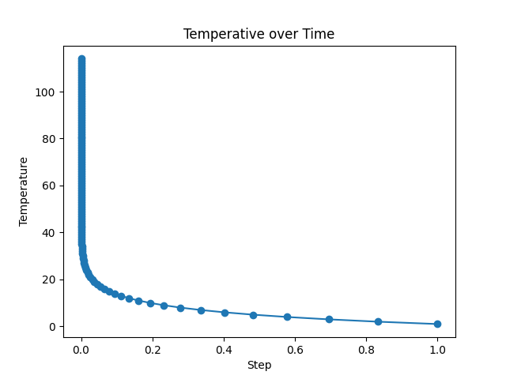
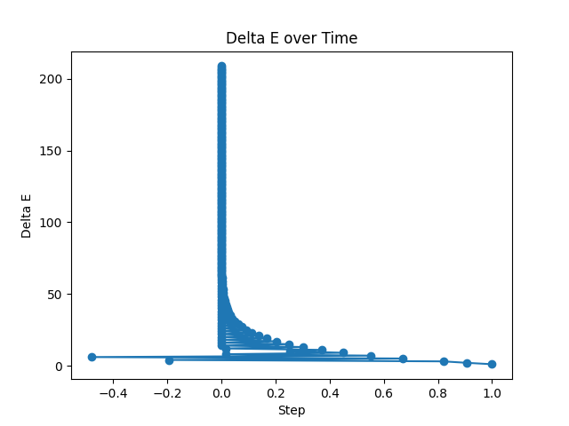
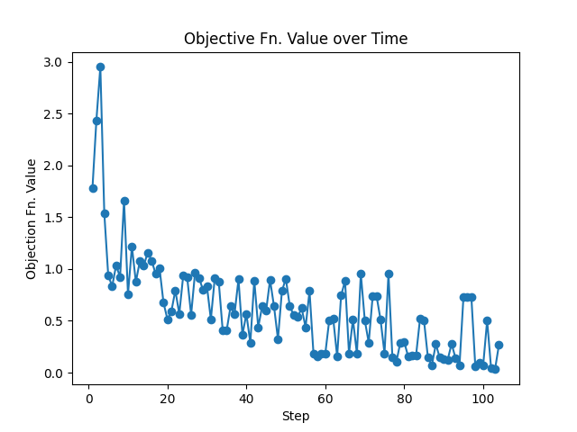
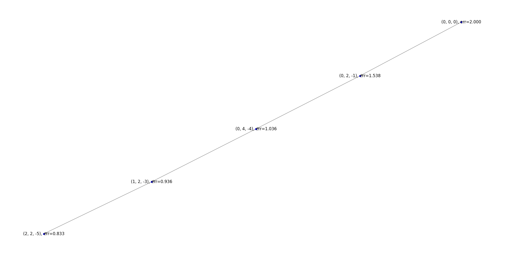
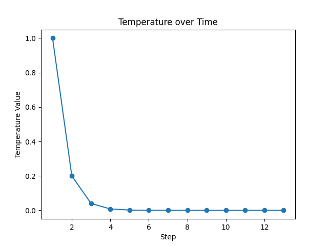
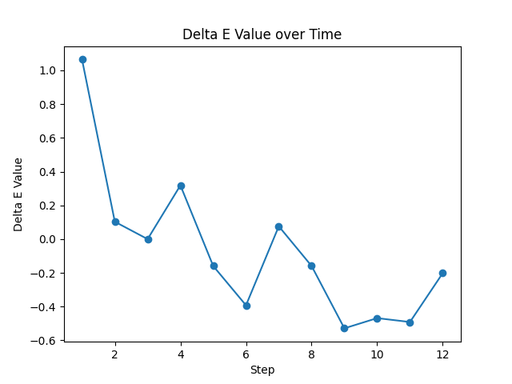
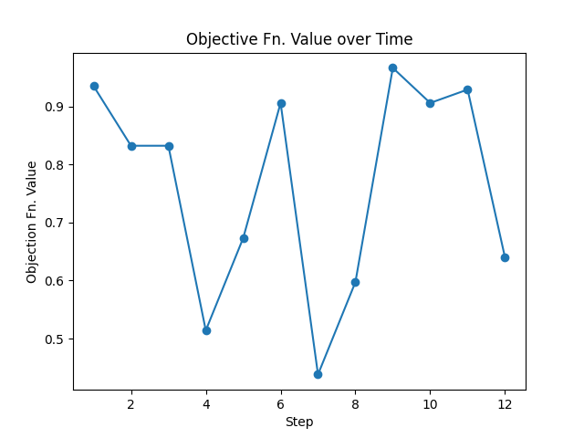
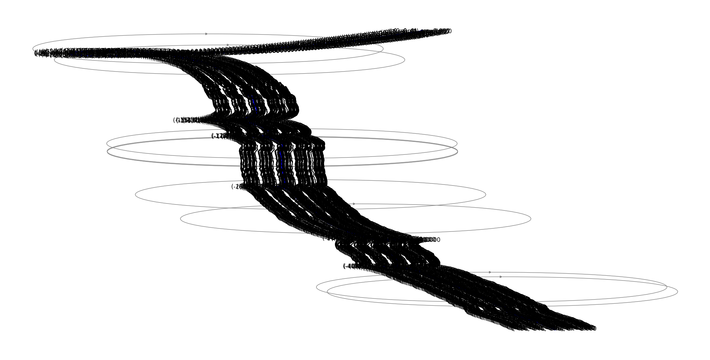
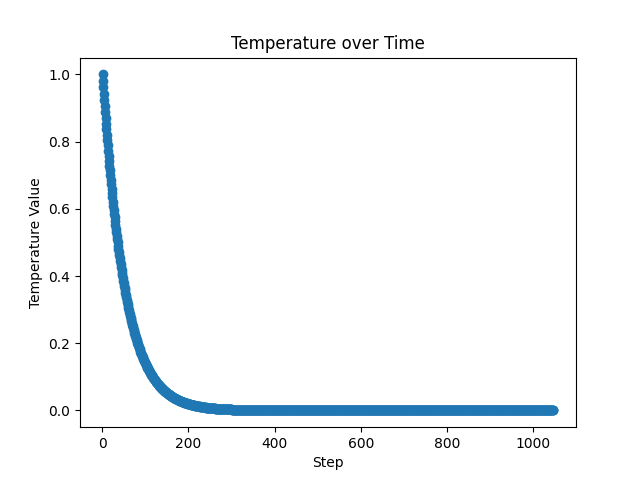

## Temperature Analysis

Simulated annealing simulates the process of annealing glass or metal.
It involves heating it up until malleable, then shaping it until it cools and hardens.

The temperature parameter, as defined bythe `schedule` lambda function in this implementation, 
can have a large impact on the output of this algorithm.

---

### Recommended Schedule

$$\lambda x : x / 1.2$$

This was the temperature schedule given as a starting point.
It performed well enough, producing incorrect weights about half of the time.

The average traced search path length:
* for subpar results $= 99$.
* for good results $= 25$.

See the $x : x / 1.2$ 

---

### Rapidly Cooling Schedule

$$\lambda x : x / 5$$

This was a temperature schedule to see what an extreme change would do to the algorithm.
It performed very poorly, failing to produce correct results in most runs.

However, the average traced search path length was significantly reduced:
* for subpar results $= 9$.
* for good results $= 5$.

Cooling off more quickly can speed up the search, but at the cost of accuracy.

See the $x : x / 5$ 

---

### Simmering Schedule

$$\lambda x : x / 1.02$$

Now shifting to the opposite end of the spectrum by slowing down the rate of cooling.
It performed the worse, failing to ever produce correct results 
likely due to the extremely small $\Delta X$ causing near random-walk behavior.

Additionally, the average traced search path length
* for subpar results $> 1,000$.
* good results never happened.

Cooling off too quickly can slow down the search significantly 
and lead to unpredictable behavior.

See the $x : x / 1.02$ 

---
